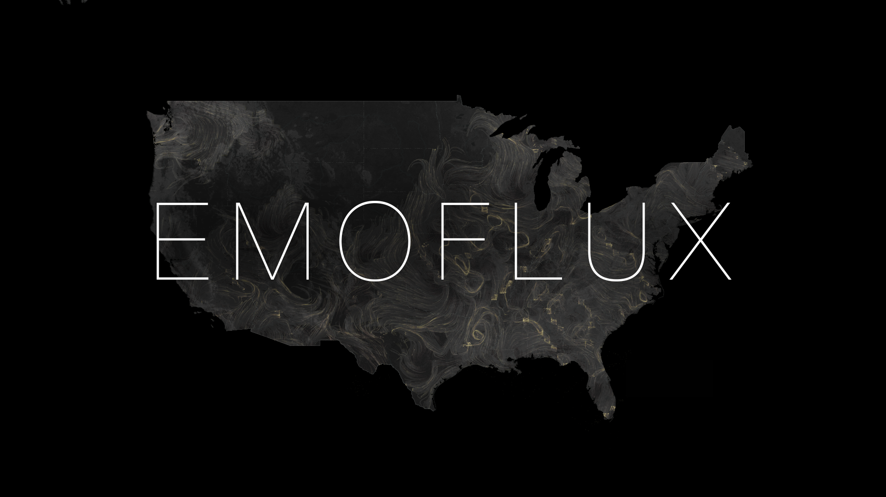
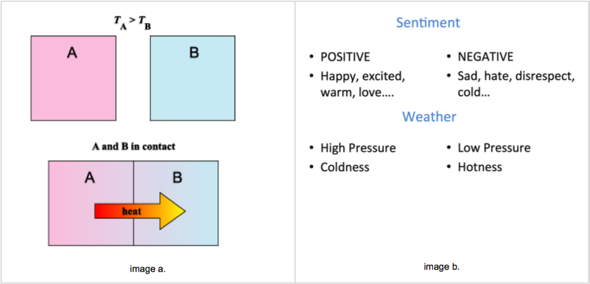
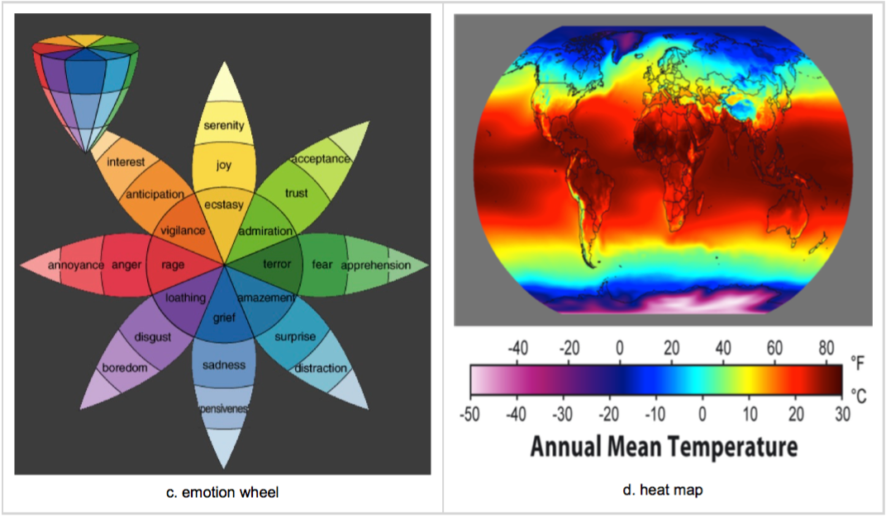
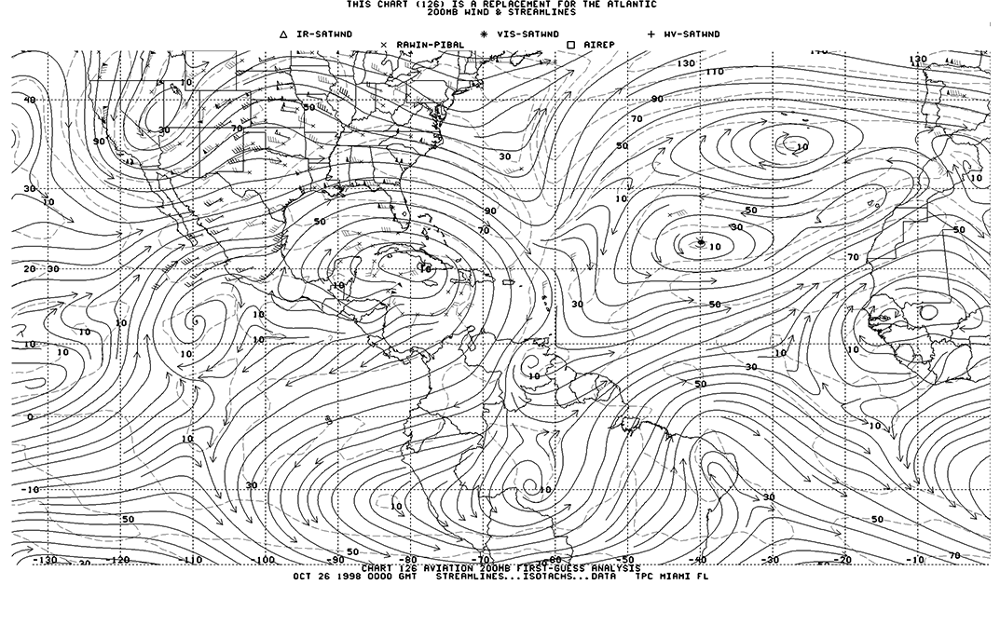
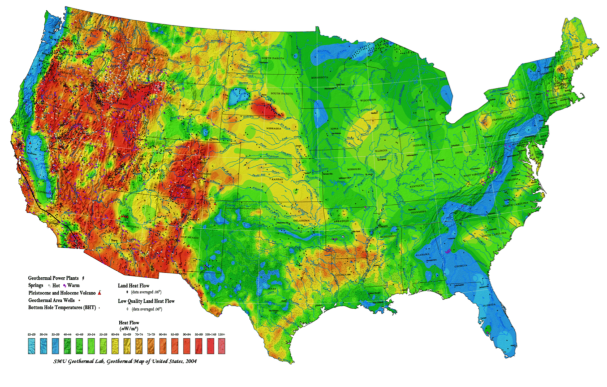
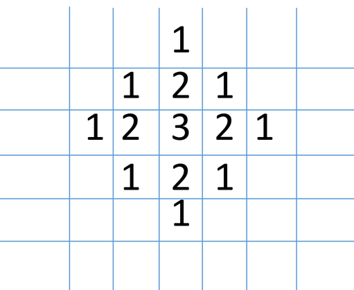
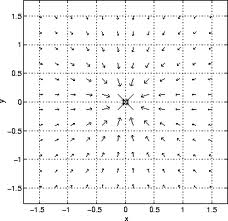

video link : https://vimeo.com/116522707

**EmoFlux** is a system that visualizes the emotional flow as a weather pattern. It allows the audience to see the emotional circulation and distribution across the country and the neighborhoods that they live in. Through this project, I discover and explore the relationships between the geographical space and emotions that are shared via Twitter. I delve into this  concept from two angles: firstly, how are people’s emotions are related to their neighborhoods? and secondly, how the infra structure affects people sharing their emotions through SNS (specifically Twitter).

## **Concept**

I have always been fascinated with examining data on maps, as it provides information about altitude, climate, population or other trivial facts suchs as of the number of bikes stolen. This information with geographical images allows the viewer to begin to develop an understanding of life in neighborhoods, cities and countries without going to the physical location. Thus, information becomes more tangible as images and stories rather than abstract numbers. With this tangible sense of geospatial data, I draw a connection between how the data explains itself and the relationship between real life and the spaces where people live.

* Emotion and the Weather. In terms of these two constituents, there is a strong connection: Weather is the state of the **atmosphere **at a **particular time **and a **particular place**. "State" is the operative word I aim to focus on. A state in itself is a very relatable experience to weather, but more than that, it is an operative state within the human condition. The definition of atmosphere itself (using words like ‘mood’ and ‘ influence’ in itself enhances the connection that I am suggesting between *Emotion* and the* weather* as these are very humanistic descriptions).

* Temperature is commonly referred to as a degree of hotness or coldness and this difference in degrees creates the motion/transfer of molecules. (image a.)

* This set of principles associated with weather are strongly related to emotion. (image b,c,d.)

I combined the set of principles with maps similar to the ones below in order to build the foundation of Emoflux. 

## **Algorithm**

I implemented an algorithm that allows particles to have a natural flow based upon the two main ideas of heat transfer and flow motion.

1.Grid map (heat transfer):

* I created a grid map that consists of a 2D array to store positive/negative values with converted geo-location data of tweets. 

* To implement a heat transfer, I iterate through neighbor cells and subtract or add 1 from the initial cell where it stored a positive or negative tweet.

2. Flow motion (Vector field)

* In order to implement flow, I created vector field that consists of directions of each cells

* With calculating the direction for each cell, I simply subtracted right from left to get X value and subtracted bottom from top to get Y value. e.g) V = (right-left, top-bottom)

* Going through every cell, the outcome looks similar to the figure like below:

The algorithm in itself becomes the basis of Emoflux as it synchronizes with the map (the platform) in order to  display the distribution of Twitter feeds in the US in real time.

